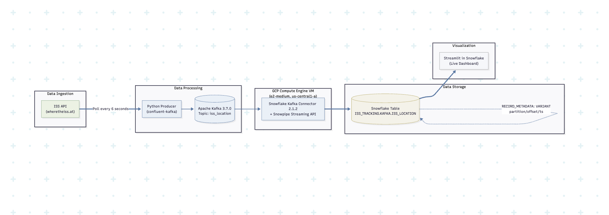
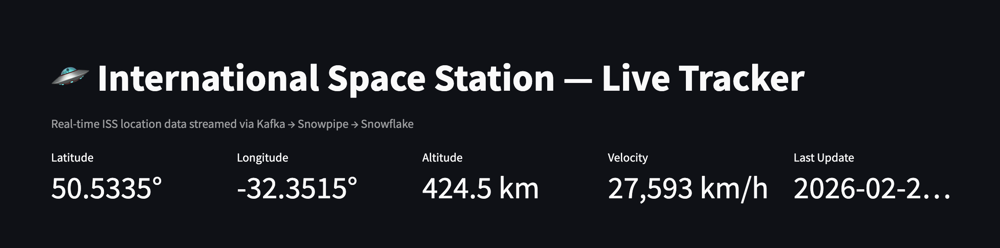
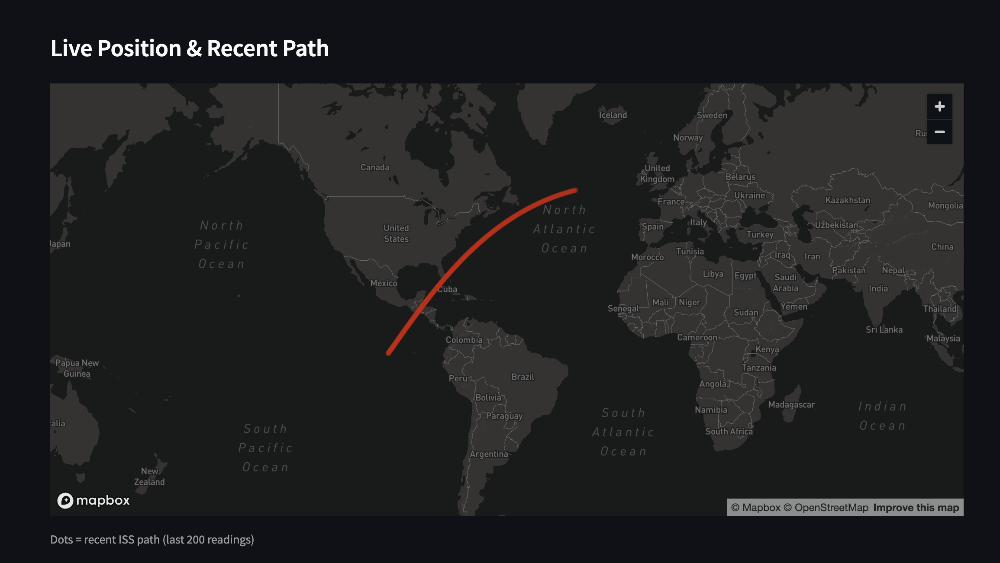
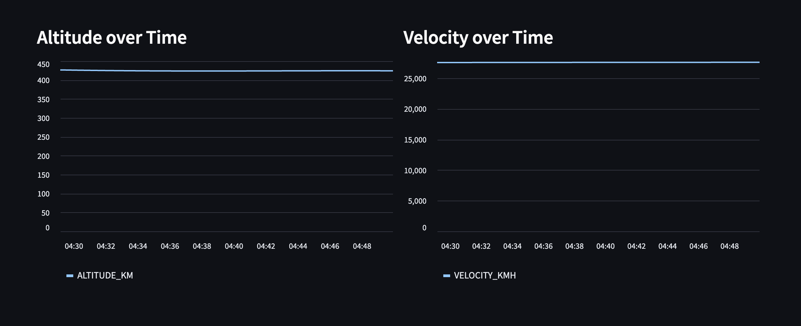

# 🛰️ ISS Real-Time Tracking Pipeline

> Stream live International Space Station telemetry from a public API through Apache Kafka into Snowflake — visualized on a live Streamlit dashboard.


---

## Overview

This project builds an end-to-end real-time data pipeline that polls the ISS location every 6 seconds, publishes it to a Kafka topic running on GCP, ingests it into Snowflake via the Snowflake Kafka Connector and Snowpipe Streaming, and renders it on a live dashboard hosted inside Snowflake's native Streamlit.

The ISS travels at ~27,500 km/h, completing one orbit roughly every 90 minutes. At 6-second polling intervals, you capture ~15 readings per orbit minute — enough to render a smooth orbital track across the map.

---

## Architecture

```
ISS API (wheretheiss.at)
        │
        │  poll every 6 seconds
        ▼
  Python Producer
  (confluent-kafka)
        │
        ▼
  Apache Kafka
  Topic: iss_location
  (GCP Compute Engine VM)
        │
        ▼
  Snowflake Kafka Connector
  + Snowpipe Streaming API
        │
        ▼
  Snowflake Table
  ISS_TRACKING.KAFKA.ISS_LOCATION
        │
        ▼
  Streamlit in Snowflake
  (Live Dashboard)
```



---

## Tech Stack

| Layer | Tool | Notes |
|---|---|---|
| Compute | GCP Compute Engine (e2-medium, us-central1-a) | Runs Kafka + producer |
| Message Broker | Apache Kafka 3.7.0 | Single-node, managed via scripts |
| Data Source | [wheretheiss.at](https://wheretheiss.at) API | Free, no auth required |
| Producer | Python + `confluent-kafka` | Lightweight polling loop |
| Connector | Snowflake Kafka Connector 2.1.2 | JAR deployed on Kafka VM |
| Ingestion | Snowpipe Streaming API | Low-latency, micro-batch ingestion |
| Storage | Snowflake (Enterprise) | VARIANT columns for semi-structured JSON |
| Dashboard | Streamlit in Snowflake | No separate hosting needed |

---

## Project Structure

```
iss-tracking/
├── producer.py               # Polls ISS API, publishes to Kafka topic
├── streamlit_app.py          # Streamlit dashboard (deploy in Snowflake)
├── snowflake_setup.py        # One-time Snowflake setup (run locally)
├── requirements.txt          # Python dependencies
├── config.env.template       # Config template — copy to config.env and fill in
├── scripts/
│   ├── setup_vm.sh           # One-time GCP VM provisioning
│   ├── start_pipeline.sh     # Start all pipeline components in order
│   └── stop_pipeline.sh      # Gracefully stop all pipeline components
└── keys/                     # RSA key pair — gitignored, generate locally
```

---

## Prerequisites

Before you begin, make sure you have:

- A GCP account with billing enabled
- A Snowflake account (Enterprise or higher — required for Snowpipe Streaming)
- `gcloud` CLI installed and authenticated locally
- Python 3.10 or higher
- Node.js (optional, for local Streamlit testing)

---

## Setup

### 1. Clone and configure

```bash
git clone <your-repo-url>
cd iss-tracking
cp config.env.template config.env
```

Open `config.env` and fill in your GCP project details and Snowflake account credentials. This file is gitignored — never commit it.

### 2. Install Python dependencies

```bash
pip install -r requirements.txt
```

### 3. Generate an RSA key pair

The Snowflake Kafka Connector authenticates using RSA key-pair auth rather than a password.

```bash
mkdir -p keys
openssl genrsa -out keys/rsa_key.pem 2048
openssl rsa -in keys/rsa_key.pem -pubout -out keys/rsa_key.pub
```

The private key (`rsa_key.pem`) stays on the VM and is referenced by the connector config. The public key (`rsa_key.pub`) is registered with the Snowflake user in the next step.

### 4. Set up Snowflake

```bash
pip install snowflake-connector-python
python3 snowflake_setup.py
```

This script creates the following Snowflake resources:

- **Database:** `ISS_TRACKING`
- **Schema:** `KAFKA`
- **Warehouse:** `KAFKA_WH`
- **User:** `KAFKA_USER` (RSA key auth, no password)
- **Role:** `KAFKA_ROLE` with appropriate grants on the above

### 5. Provision the GCP VM

```bash
chmod +x scripts/*.sh
./scripts/setup_vm.sh
```

This provisions the VM and installs: Java 11, Python 3, Kafka 3.7.0, the Snowflake Kafka Connector JAR, and copies all required project files and keys to the VM.

### 6. Start the pipeline

```bash
./scripts/start_pipeline.sh
```

The script starts all components in dependency order:

1. Zookeeper
2. Kafka broker
3. Creates the `iss_location` topic (if it doesn't exist)
4. Snowflake Kafka Connector (connects Kafka → Snowflake)
5. Python ISS producer (begins polling the API)

Allow ~30 seconds for the connector to initialize before data begins flowing into Snowflake.

### 7. Deploy the Streamlit dashboard

In the Snowflake UI, go to **Projects → Streamlit → + Streamlit App**, create a new app, and paste the contents of `streamlit_app.py`.

Once deployed, open: **Snowflake UI → Projects → Streamlit → ISS_LIVE_TRACKER**





---

## Dashboard Features

The Streamlit app queries Snowflake directly and displays:

- **Live metrics** — current latitude, longitude, altitude, velocity, and time of last update
- **World map** — ISS orbital path using the last 200 readings (~20 minutes of data)
- **Altitude over time** — line chart showing altitude variation across the orbit
- **Velocity over time** — line chart for velocity (slight variations are normal due to orbital mechanics)
- **Raw data table** — last 50 records with all fields
- **Manual refresh** button to pull the latest snapshot from Snowflake on demand

---

## Data Schema

**Table:** `ISS_TRACKING.KAFKA.ISS_LOCATION`

| Column | Type | Description |
|---|---|---|
| `RECORD_METADATA` | VARIANT | Kafka offset, partition, and ingest timestamp |
| `RECORD_CONTENT` | VARIANT | ISS payload (see structure below) |

**RECORD_CONTENT payload:**

```json
{
  "timestamp": 1234567890,
  "latitude": -34.5,
  "longitude": 120.3,
  "altitude_km": 440.5,
  "velocity_kmh": 27524.0
}
```

---

## Stopping the Pipeline

To gracefully stop all components (producer → connector → Kafka → Zookeeper):

```bash
./scripts/stop_pipeline.sh
```

To pause just the producer without tearing down Kafka:

```bash
# SSH into the VM and kill only the producer process
ssh <your-vm> "pkill -f producer.py"
```

---

## License

MIT — free to use, modify, and distribute.
